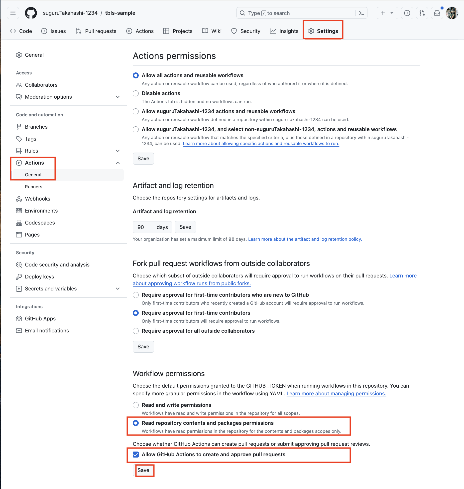
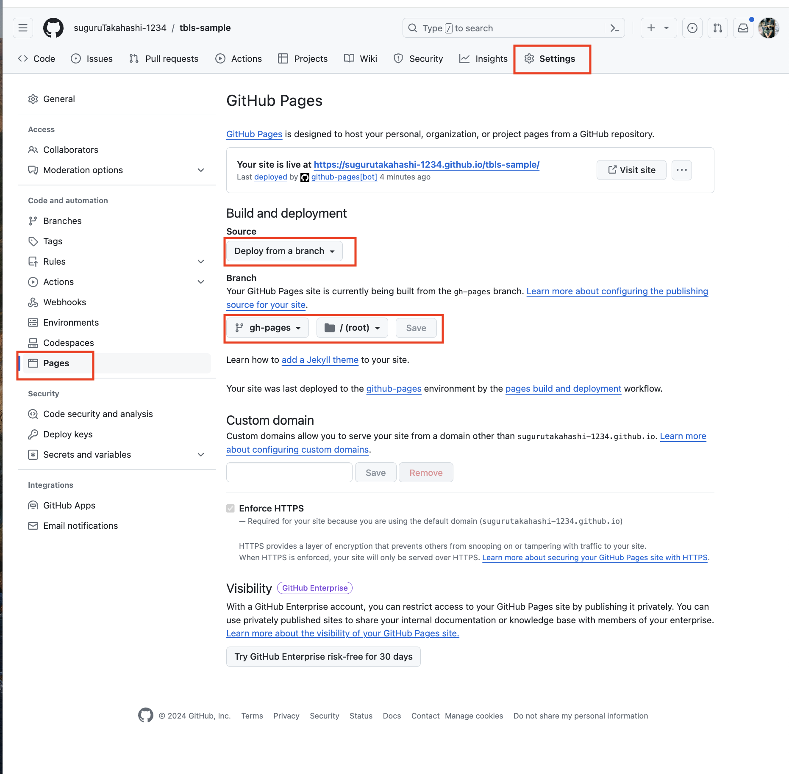

# tbls docs

1. CREATE TABLE 文を記述した [schema.sql](./sql/schema.sql) を更新する
2. main branch の更新をトリガーに GitHub Actions 上で、[tbls](https://github.com/k1LoW/tbls) によって DB ドキュメントを Markdown 形式で生成し、DB ドキュメント更新の PR を自動作成する
3. PR をレビューして merge する
4. DB ドキュメントが更新されたことをトリガーに GitHub Actions 上で、[MkDocs](https://github.com/mkdocs/mkdocs) によって、Markdown 形式を HTML へ変換し、GitHub Pages へホスティングする
5. [GitHub Pages](https://sugurutakahashi-1234.github.io/tbls-sample/) で main ブランチの [schema.sql](./sql/schema.sql) に基づく DB ドキュメントが閲覧可能になる

生成されたドキュメントの書式は、[tbls.yml](./tbls.yml) や [mkdocs.yml](mkdocs.yml) で変更可能であり、詳しくは公式ドキュメントを参照ください。

### DB Documents on GitHub Pages

- https://sugurutakahashi-1234.github.io/tbls-sample/

### Settings

#### Actions

#### Pages

### Lisks

- tbls
  - https://github.com/k1LoW/tbls
- MkDocs
  - https://github.com/mkdocs/mkdocs
- DBスキーマはtblsのViewpointsで整理しよう
  - https://zenn.dev/micin/articles/2023-12-05-majimaccho-tbls
- tblsのViewPoint機能を用いたGithub Actions上でのDBドキュメントの自動生成
  - https://engineers.safie.link/entry/2023/12/02/build-db-doc-by-tbls
- GitHub Actions
  - https://github.com/k1LoW/setup-tbls
  - https://github.com/peter-evans/create-pull-request
  - https://github.com/actions/setup-python
