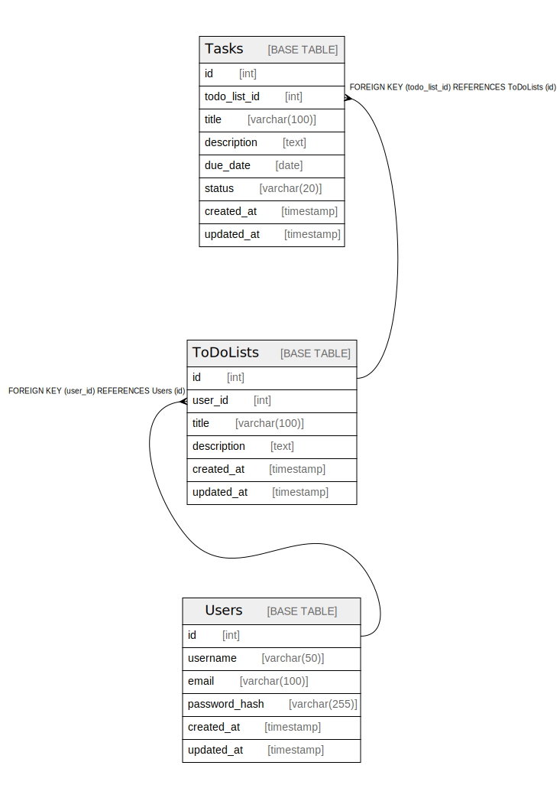

# tbls_database

## Tables

| Name | Columns | Comment | Type |
| ---- | ------- | ------- | ---- |
| [Tasks](Tasks.md) | 8 |  | BASE TABLE |
| [ToDoLists](ToDoLists.md) | 6 |  | BASE TABLE |
| [Users](Users.md) | 6 |  | BASE TABLE |

## Relations

---

> Generated by [tbls](https://github.com/k1LoW/tbls)
