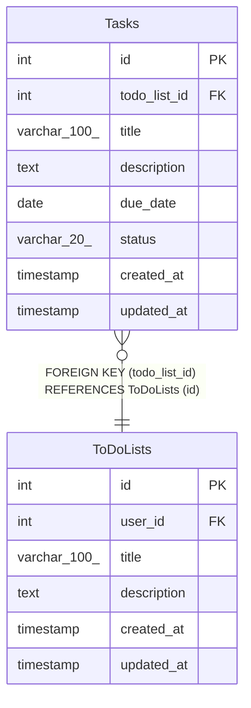

# Tasks

## Description

<details>
<summary><strong>Table Definition</strong></summary>

```sql
CREATE TABLE `Tasks` (
  `id` int NOT NULL AUTO_INCREMENT,
  `todo_list_id` int NOT NULL,
  `title` varchar(100) NOT NULL,
  `description` text,
  `due_date` date DEFAULT NULL,
  `status` varchar(20) DEFAULT 'pending',
  `created_at` timestamp NULL DEFAULT CURRENT_TIMESTAMP,
  `updated_at` timestamp NULL DEFAULT CURRENT_TIMESTAMP ON UPDATE CURRENT_TIMESTAMP,
  PRIMARY KEY (`id`),
  KEY `todo_list_id` (`todo_list_id`),
  CONSTRAINT `Tasks_ibfk_1` FOREIGN KEY (`todo_list_id`) REFERENCES `ToDoLists` (`id`) ON DELETE CASCADE
) ENGINE=InnoDB DEFAULT CHARSET=utf8mb4 COLLATE=utf8mb4_0900_ai_ci
```

</details>

## Columns

| Name | Type | Default | Nullable | Extra Definition | Children | Parents | Comment |
| ---- | ---- | ------- | -------- | ---------------- | -------- | ------- | ------- |
| id | int |  | false | auto_increment |  |  |  |
| todo_list_id | int |  | false |  |  | [ToDoLists](ToDoLists.md) |  |
| title | varchar(100) |  | false |  |  |  |  |
| description | text |  | true |  |  |  |  |
| due_date | date |  | true |  |  |  |  |
| status | varchar(20) | pending | true |  |  |  |  |
| created_at | timestamp | CURRENT_TIMESTAMP | true | DEFAULT_GENERATED |  |  |  |
| updated_at | timestamp | CURRENT_TIMESTAMP | true | DEFAULT_GENERATED on update CURRENT_TIMESTAMP |  |  |  |

## Constraints

| Name | Type | Definition |
| ---- | ---- | ---------- |
| PRIMARY | PRIMARY KEY | PRIMARY KEY (id) |
| Tasks_ibfk_1 | FOREIGN KEY | FOREIGN KEY (todo_list_id) REFERENCES ToDoLists (id) |

## Indexes

| Name | Definition |
| ---- | ---------- |
| todo_list_id | KEY todo_list_id (todo_list_id) USING BTREE |
| PRIMARY | PRIMARY KEY (id) USING BTREE |

## Relations



---

> Generated by [tbls](https://github.com/k1LoW/tbls)
