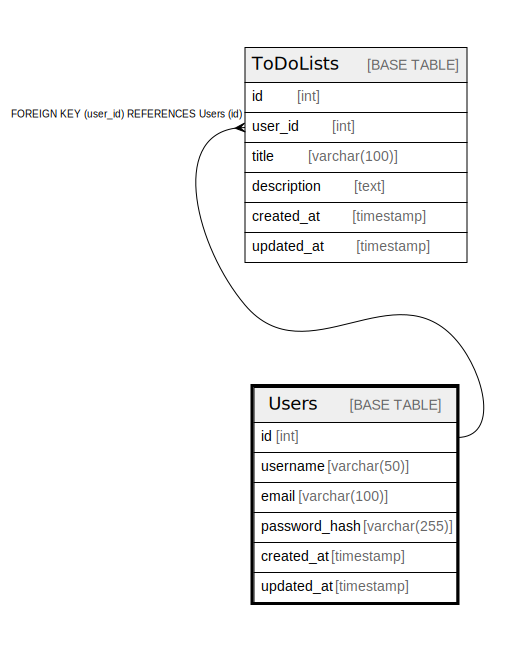

# Users

## Description

ユーザー情報を保存するテーブル

<details>
<summary><strong>Table Definition</strong></summary>

```sql
CREATE TABLE `Users` (
  `id` int NOT NULL AUTO_INCREMENT,
  `username` varchar(50) NOT NULL COMMENT 'ユーザー名',
  `email` varchar(100) NOT NULL COMMENT 'メールアドレス',
  `password_hash` varchar(255) NOT NULL COMMENT 'パスワードのハッシュ',
  `created_at` timestamp NULL DEFAULT CURRENT_TIMESTAMP,
  `updated_at` timestamp NULL DEFAULT CURRENT_TIMESTAMP ON UPDATE CURRENT_TIMESTAMP,
  PRIMARY KEY (`id`),
  UNIQUE KEY `username` (`username`),
  UNIQUE KEY `email` (`email`)
) ENGINE=InnoDB DEFAULT CHARSET=utf8mb4 COLLATE=utf8mb4_0900_ai_ci COMMENT='ユーザー情報を保存するテーブル'
```

</details>

## Columns

| Name | Type | Default | Nullable | Extra Definition | Children | Parents | Comment |
| ---- | ---- | ------- | -------- | ---------------- | -------- | ------- | ------- |
| id | int |  | false | auto_increment | [ToDoLists](ToDoLists.md) |  |  |
| username | varchar(50) |  | false |  |  |  | ユーザー名 |
| email | varchar(100) |  | false |  |  |  | メールアドレス |
| password_hash | varchar(255) |  | false |  |  |  | パスワードのハッシュ |
| created_at | timestamp | CURRENT_TIMESTAMP | true | DEFAULT_GENERATED |  |  |  |
| updated_at | timestamp | CURRENT_TIMESTAMP | true | DEFAULT_GENERATED on update CURRENT_TIMESTAMP |  |  |  |

## Constraints

| Name | Type | Definition |
| ---- | ---- | ---------- |
| email | UNIQUE | UNIQUE KEY email (email) |
| PRIMARY | PRIMARY KEY | PRIMARY KEY (id) |
| username | UNIQUE | UNIQUE KEY username (username) |

## Indexes

| Name | Definition |
| ---- | ---------- |
| PRIMARY | PRIMARY KEY (id) USING BTREE |
| email | UNIQUE KEY email (email) USING BTREE |
| username | UNIQUE KEY username (username) USING BTREE |

## Relations



---

> Generated by [tbls](https://github.com/k1LoW/tbls)
